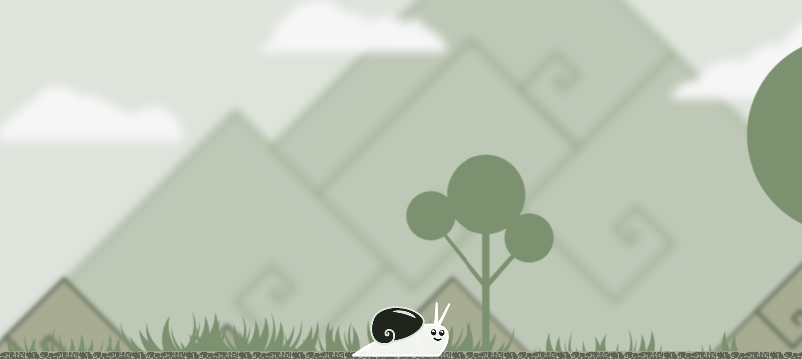
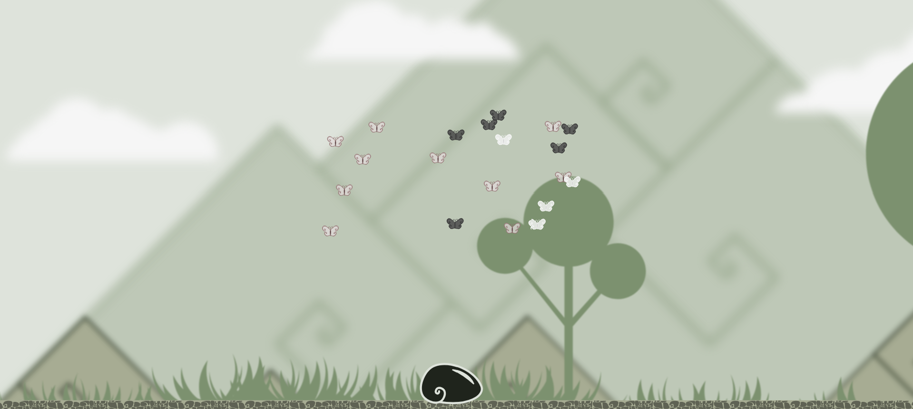

# 🌐 My Portfolio

This is my personal portfolio website, built with [Vite](https://vitejs.dev/) + [React](https://react.dev/) + [TypeScript](https://www.typescriptlang.org/).  
It showcases some of my projects in **web design**/**web development** and **illustration**.

---

## ✨ Features

- Responsive single-page application (SPA)
- Custom animations (e.g. Snail Trail 🐌)
- Interactive mini-games (Odds & Evens, Memory, …)
- Hand-drawn artworks and portraits
- Extendable projects section
- Finishing touch: an animated coffee cup ☕ with sugar dropping in

---

## 🛠️ Tech Stack

- **Frontend:** React, TypeScript, Vite
- **Styling:** CSS Modules / Tokens
- **Animations:** CSS + Canvas + SVG
- **Deployment:** (Vercel / Netlify / my website/server)

---

## 🚀 Getting Started

Clone the repo and install dependencies:

```bash
git clone https://github.com/your-username/portfolio.git
cd portfolio
npm install
npm run dev
```

---

## 📂 Project Structure

├── public/ # Static assets (favicons, etc.)
├── src/
│ ├── assets/ # Images, SVGs, icons
│ ├── components/ # React components
│ ├── styles/ # Global styles + tokens
│ └── App.tsx # Main app
├── vite.config.ts # Vite configuration
└── tsconfig.json # TypeScript configuration

---

📸 Screenshots

## 📸 Screenshots

### Snail Trail 🐌





### Memory Game 🧠


---

📜 License

This project is for personal/educational use.
You’re welcome to look around the code ✨

---

🤝 Contact

Portfolio: remislanina.com

Email: remislanina@gmail.com

---
